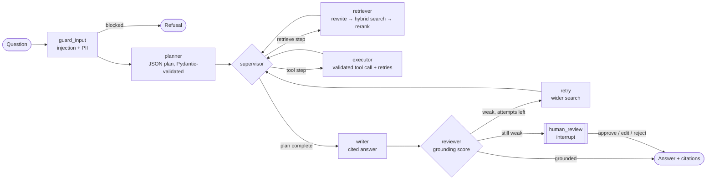

# Agentic RAG Assistant

A production-style **multi-agent retrieval-augmented generation (RAG)** service built with **LangGraph**.
A supervisor agent routes work between planner, retriever and executor agents; answers are checked for
grounding, retried with a wider search when weak, and escalated to a **human-in-the-loop** checkpoint
that pauses the thread until a reviewer approves, edits or rejects the draft.


## Features

- **Multi-agent workflow (LangGraph):** guard → planner → supervisor ⇄ {retriever, executor} → writer → reviewer
- **Hybrid retrieval:** Chroma dense vectors + BM25 keyword search, fused with Reciprocal Rank Fusion, then re-ranked
- **Query rewriting** before every search, and wider search (`k × attempt`) on retry
- **Pydantic-validated function calling:** the planner's JSON plan and every tool input are schema-validated; failed tool calls are repaired by the LLM and retried
- **Guardrails:** prompt-injection detection, PII redaction (SSN, card numbers, emails), length limits, grounding check on every answer
- **Human-in-the-loop:** LangGraph `interrupt()` + checkpointer — paused threads resume later without losing progress
- **Citations:** every answer cites the chunks it used, mapped back to source files
- **Evaluation:** golden-set harness for hit rate, citation accuracy, grounding and latency, with optional **Ragas** metrics
- **Ships as a service:** FastAPI, Docker, docker-compose, GitHub Actions CI (lint, tests, eval, Docker build)
- **Runs offline:** without an `OPENAI_API_KEY` it uses deterministic local components, so tests and demos need no keys

## Architecture



| Module | Responsibility |
|---|---|
| `graph.py` | LangGraph state machine, agents, routing, retries, human review |
| `retrieval.py` | Chunking, Chroma vector store, BM25, RRF fusion, re-ranking |
| `guardrails.py` | Input checks, PII redaction, grounding score |
| `tools.py` | Pydantic-validated tools (safe AST calculator; add your own) |
| `llm.py` | OpenAI chat + embeddings via LangChain, with offline fallbacks |
| `assistant.py` | Facade: `ask()` and `resume()` with per-thread checkpoints |
| `api.py` | FastAPI service |
| `eval/run_eval.py` | Golden-set evaluation, optional Ragas |

## Quickstart

```bash
git clone https://github.com/kadiyalasuryateja/agentic-rag-assistant.git
cd agentic-rag-assistant
python -m venv .venv && source .venv/bin/activate
pip install -e ".[dev]"

cp .env.example .env            # optional: add OPENAI_API_KEY for GPT-4o-mini + OpenAI embeddings

agentic-rag ingest data/docs
agentic-rag ask "How many unused PTO days carry over, and what is 1.5 * 12?" --trace
```

```text
Up to 5 unused days can be carried over into the next calendar year. [1] Full-time employees accrue
1.5 days of paid time off per month, for a total of 18 days per year. [1] Computed result: 1.5 * 12 = 18
  [1] hr_policies.md
status=answered grounding=0.917
  - guard_input: ok
  - planner: 2 step(s)
  - supervisor: step 1/2
  - retriever: 'many unused pto days carry over 12' -> 3 chunk(s)
  - supervisor: step 2/2
  - executor: 1.5 * 12 = 18
  - supervisor: plan complete -> writer
  - writer: drafted answer
  - reviewer: grounding=0.917
```

### Run the API

```bash
uvicorn agentic_rag.api:app --reload        # or: docker compose up --build
```

Open http://localhost:8000/docs for the interactive Swagger UI.

```bash
# Ask a question
curl -s localhost:8000/chat -H 'content-type: application/json' \
  -d '{"question": "How often are laptops refreshed?"}'

# Add knowledge
curl -s localhost:8000/ingest -H 'content-type: application/json' \
  -d '{"source": "faq.md", "text": "The office parking garage opens at 6 AM."}'

# A question the knowledge base can't answer pauses for review...
curl -s localhost:8000/chat -H 'content-type: application/json' \
  -d '{"question": "What is the cafeteria menu on Monday?"}'
# -> {"status": "needs_review", "thread_id": "…", "review": {"draft_answer": "…", "options": [...]}}

# ...and resumes from its checkpoint once a reviewer decides
curl -s localhost:8000/threads/<thread_id>/resume -H 'content-type: application/json' \
  -d '{"action": "edit", "answer": "Please check the cafeteria page on the intranet."}'
```

| Endpoint | Description |
|---|---|
| `GET /health` | Liveness and number of indexed chunks |
| `POST /ingest` | Chunk, embed and index a document |
| `POST /chat` | Run the multi-agent workflow (optional `thread_id`) |
| `POST /threads/{id}/resume` | Resume a paused thread with `approve`, `edit` or `reject` |

## Evaluation

```bash
python eval/run_eval.py --docs data/docs                  # offline metrics
pip install -e ".[eval]" && python eval/run_eval.py --ragas  # + Ragas (needs OPENAI_API_KEY)
```

Offline results on the bundled golden set (10 questions):

| Metric | Score |
|---|---|
| Answer rate | 1.00 |
| Retrieval hit rate @4 | 1.00 |
| Top citation accuracy | 1.00 |
| Mean grounding | 1.00 |
| p50 latency (offline) | ~15 ms |

With `--ragas` the report adds faithfulness, answer relevancy and context precision, which is how prompt and
retrieval changes should be compared release to release.

## Configuration

All settings use the `RAG_` prefix (see `config.py`):

| Variable | Default | Purpose |
|---|---|---|
| `OPENAI_API_KEY` | – | Enables OpenAI chat + embeddings; offline mode when unset |
| `RAG_CHAT_MODEL` | `gpt-4o-mini` | Chat model |
| `RAG_EMBEDDING_MODEL` | `text-embedding-3-small` | Embedding model |
| `RAG_TOP_K` | `4` | Chunks passed to the writer |
| `RAG_CHUNK_SIZE` / `RAG_CHUNK_OVERLAP` | `400` / `60` | Chunking |
| `RAG_MIN_GROUNDING_SCORE` | `0.35` | Reviewer threshold |
| `RAG_MAX_RETRIEVAL_ATTEMPTS` | `2` | Retries before human review |
| `RAG_MAX_TOOL_RETRIES` | `2` | Repair attempts for failed tool calls |

## Tests

```bash
pytest -q
```

The suite covers chunking, guardrails, tool validation, hybrid search, planning with tool calls, retries,
human-in-the-loop pause/resume, thread reuse, and the HTTP API end to end.

## Roadmap

- Cross-encoder re-ranker (`ms-marco-MiniLM`) behind a flag
- SQLite/Postgres checkpointer for durable threads across restarts
- LangSmith tracing and per-release cost tracking
- Streaming responses over Server-Sent Events

## License

MIT © Surya Teja Kadiyala
